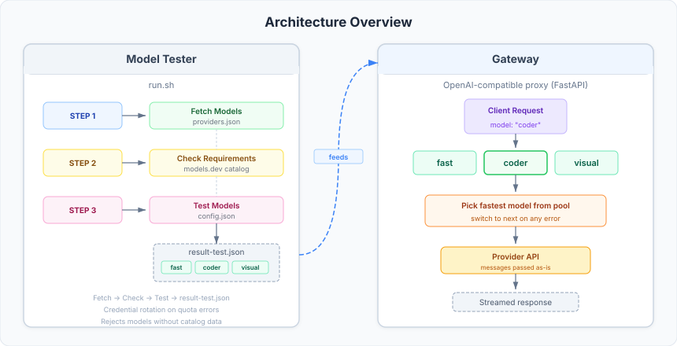

# Model Dial

> Stable AI models without babysitting. Model Dial automatically picks the fastest model and switches on errors.

**The problem:** You have API keys for several AI providers, but models go down, hit rate limits, or get slow under load. Manually switching between them is tedious — especially with multiple agents.

**The solution:** Model Dial acts as a single OpenAI-compatible endpoint that automatically selects the fastest working model and fails over to the next one when something breaks.

<div align="center">
  
</div>

## Prerequisites

- **Docker** — for running Model Dial in containers
- **API keys** — at least one provider (Google, OpenAI, NVIDIA, OpenRouter, etc.)

> No Docker? See [Local Setup →](docs/local-setup.md)

## Quick Start (3 steps)

```bash
# 1. Start the containers
cd model-dial
make up

# 2. Add your API keys to providers.json (see example below), then test models
make test

# 3. Use the gateway at http://localhost:8765 — that's it!
```

**Example — adding your first provider to `providers.json`:**

```json
{
  "openrouter": {
    "type": "openai",
    "credentials": [
      {
        "base_url": "https://openrouter.ai/api/v1",
        "api_key": "sk-or-v1-YOUR_API_KEY_HERE"
      }
    ]
  }
}
```

Remove the example providers that aren't yours and add your own. See [providers docs](docs/providers.md) for all supported provider types.

> **Note:** Currently only `"openai"` (OpenAI-compatible) and `"google"` provider types are supported. Other API formats are planned for future releases.

## Verify it works

```bash
make client
```

Select a model and start chatting. Use `/quit` to exit.

## How It Works

Model Dial has two parts:

1. **Model Tester** — discovers models from your providers, checks them against a catalog, tests speed and quality, and builds an ordered pool per category (e.g., `coder`, `visual`, `fast`)
2. **Gateway** — an OpenAI-compatible proxy that receives your requests and routes them to the fastest available model in the requested category

If a model fails (rate limit, quota, error), the gateway automatically tries the next API key, then the next model. Your app doesn't notice — the response streams normally.

## Daily Usage

```bash
make state              # see which models are active + live logs
make test               # re-scan and re-test models, update the gateway
make logs               # stream docker logs
```

### Manual control

```bash
make restart                         # restart gateway
make switch CATEGORY=fast            # force next model in a category
make rotate PROVIDER=nvidia          # rotate to next API key for a provider
make reset                           # clear state, restart with fresh defaults
```

### OpenCode integration

```bash
make config-opencode    # generates provider config for opencode.jsonc
```

See [docs/opencode.md](docs/opencode.md) for details.

## Configuration

Three files control Model Dial (click for full reference):

| File | Purpose |
|------|---------|
| [`providers.json`](docs/providers.md) | API keys and provider types (**start here**) |
| [`config.json`](docs/config.md) | Categories, model requirements, test params, gateway settings |
| [`deny.json`](docs/deny.md) | Optional: block specific models from testing |

## Auto-testing

By default, models are re-tested every hour. Configure or disable in `docker-compose.yml`:

```yaml
environment:
  SCHEDULER_INTERVAL: 60            # minutes (default: 60). Comment out to disable.
  # OR run at specific times:
  # SCHEDULER_TIMES: "08:00 14:00 20:00"
```

## API Reference

The gateway exposes standard OpenAI-compatible endpoints on port **8765**:

| Endpoint | Description |
|----------|-------------|
| `GET /v1/models` | List available categories |
| `POST /v1/chat/completions` | Chat completions (streaming + non-streaming) |
| `GET /health` | Health check |

## All Commands

```bash
make help    # shows all commands grouped by category
```

> **Windows users:** Use Git Bash, WSL, or run `docker compose` commands directly.

## Documentation

| Document | Description |
|----------|-------------|
| [docs/local-setup.md](docs/local-setup.md) | Run without Docker |
| [docs/config.md](docs/config.md) | `config.json` reference |
| [docs/providers.md](docs/providers.md) | `providers.json` reference |
| [docs/deny.md](docs/deny.md) | `deny.json` reference |
| [docs/logs.md](docs/logs.md) | Log formats and levels |
| [docs/opencode.md](docs/opencode.md) | OpenCode integration |
